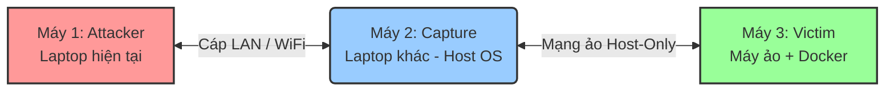

# Hướng Dẫn Thiết Lập Kiến Trúc Mạng Giả Lập Tấn Công (Tạo Dataset IDS)

Để tạo ra một tập dữ liệu (dataset) của riêng bạn thay vì phụ thuộc vào các tập dữ liệu có sẵn (như CIC-IDS-2017), việc thiết lập một môi trường kiểm thử độc lập (Testbed) là rất cần thiết. Dựa trên yêu cầu của bạn, chúng ta có 3 thực thể: **1 Laptop hiện tại**, **1 Laptop khác**, và **1 Máy ảo** trên laptop khác đó.

Dưới đây là kiến trúc tối ưu nhất để đảm bảo **Máy Capture** có thể bắt được 100% lưu lượng (traffic) đi qua giữa **Attacker** và **Victim**.

## 1. Tổng quan Kiến trúc (Architecture)

Chúng ta sẽ thiết lập **Laptop khác (Laptop 2)** đóng vai trò là một Router/Gateway. Mọi luồng dữ liệu từ Kẻ tấn công muốn đến Nạn nhân đều phải đi xuyên qua hệ điều hành của Laptop 2.

*   **Máy 1 (Laptop hiện tại của bạn): Máy Tấn công (Attacker)**
    *   Chạy các công cụ tấn công (Nmap, Metasploit, Hydra, v.v.).
    *   Có thể cài trực tiếp Kali Linux hoặc chạy Docker container chứa các công cụ tấn công.
*   **Máy 2 (Laptop khác - Host OS): Máy Bắt gói tin (Capture)**
    *   Đóng vai trò là Gateway định tuyến.
    *   Chạy Wireshark, `tcpdump` hoặc Zeek/Suricata để ghi lại toàn bộ traffic (xuất ra file `.pcap`).
*   **Máy 3 (Máy ảo trên Laptop 2): Máy Nạn nhân (Victim)**
    *   Chạy trong VirtualBox hoặc VMware trên Laptop 2.
    *   Sử dụng **Docker** để chạy các dịch vụ dễ bị tổn thương (DVWA, Metasploitable, WebGoat, MySQL, v.v.). Việc dùng Docker ở đây giúp bạn dễ dàng thay đổi kịch bản (scenario) của Nạn nhân chỉ bằng 1 câu lệnh.



---

## 2. Các Bước Cấu Hình Chi Tiết

> [!IMPORTANT]
> Để bắt gói tin ổn định nhất và ít bị nhiễu (noise) từ các dịch vụ mạng khác, bạn nên kết nối Máy 1 và Máy 2 bằng **Cáp mạng LAN trực tiếp** (Peer-to-Peer). Nếu dùng WiFi, môi trường sẽ có nhiều bản tin rác (broadcast/multicast) của các thiết bị khác trong nhà.

### Bước 2.1: Thiết lập Máy ảo Victim (Máy 3)
1. Trên Laptop 2, mở VirtualBox/VMware, tạo 1 máy ảo (khuyên dùng Ubuntu Server cho nhẹ).
2. Chỉnh cài đặt Mạng (Network) của máy ảo thành **Host-Only Adapter** (Cầu nối chỉ giữa Host và VM).
   * *Ví dụ: Card mạng ảo này tạo ra dải IP `192.168.56.x`.*
   * *Giả sử Máy ảo nhận IP là `192.168.56.101`.*
3. Khởi động Máy ảo, cài đặt **Docker** và **Docker Compose**.
4. Chạy các container làm mục tiêu. Ví dụ chạy DVWA (Damn Vulnerable Web App):
   ```bash
   docker run --rm -it -p 80:80 vulnerables/web-dvwa
   ```

### Bước 2.2: Cấu hình Máy Capture làm Gateway (Máy 2)
Laptop 2 lúc này có 2 card mạng:
*   `eth0` (hoặc `wlan0`): Kết nối với Attacker (Ví dụ IP: `10.0.0.2`).
*   `vboxnet0`: Kết nối với Máy ảo Victim (IP: `192.168.56.1`).

Để traffic từ Attacker đi được vào Victim, bạn phải bật **IP Forwarding** trên Laptop 2 (nếu Laptop 2 dùng Linux):
```bash
# Bật IP Forwarding tạm thời
sudo sysctl -w net.ipv4.ip_forward=1

# Cấu hình NAT (để Attacker có thể giao tiếp với mạng Host-Only)
sudo iptables -t nat -A POSTROUTING -o vboxnet0 -j MASQUERADE
sudo iptables -A FORWARD -i eth0 -o vboxnet0 -j ACCEPT
sudo iptables -A FORWARD -i vboxnet0 -o eth0 -j ACCEPT
```
*(Nếu Laptop 2 dùng Windows, bạn vào `Control Panel -> Network Connections`, chọn card LAN và card VMware/VirtualBox, click chuột phải chọn **Bridge Connections** hoặc dùng tính năng **Internet Connection Sharing**).*

### Bước 2.3: Cấu hình Máy Attacker (Máy 1)
1. Đặt IP tĩnh cho Máy 1 sao cho cùng dải mạng vật lý với Laptop 2 (Ví dụ: IP `10.0.0.3`).
2. Trỏ **Default Gateway** (hoặc thêm Static Route) của Máy 1 về IP của Máy 2 (`10.0.0.2`).
   ```bash
   # Thêm route trên Linux báo rằng: Muốn tìm mạng 192.168.56.x (Victim) thì phải đi qua IP của Laptop 2 (10.0.0.2)
   sudo ip route add 192.168.56.0/24 via 10.0.0.2
   ```

---

## 3. Quy trình Bắt Dữ Liệu (Capture Workflow)

Khi hệ thống đã sẵn sàng, hãy làm theo quy trình sau để tạo file dữ liệu `.pcap`:

1. **Khởi động Capture:** Trên Máy 2 (Capture), mở Terminal và chạy lệnh bắt gói tin trên cổng kết nối với Victim (hoặc Attacker).
   ```bash
   # Bắt toàn bộ gói tin và lưu ra file dataset_attack_1.pcap
   sudo tcpdump -i vboxnet0 -w dataset_attack_1.pcap
   ```
2. **Khởi chạy Kịch bản Bình thường (Benign Traffic):** 
   Sử dụng một đoạn script Python tự động gửi HTTP Request, đăng nhập, duyệt web bình thường từ Máy 1 -> Máy 3 để có dữ liệu "Sạch".
3. **Thực hiện Tấn công (Malicious Traffic):**
   Từ Máy 1 (Attacker), sử dụng các công cụ để tấn công vào IP của Máy 3 (`192.168.56.101`).
   * *Ví dụ: Quét cổng bằng Nmap, Bruteforce bằng Hydra, khai thác SQL Injection trên DVWA.*
4. **Dừng Capture & Trích xuất:**
   Quay lại Máy 2, nhấn `Ctrl+C` để dừng `tcpdump`. File `dataset_attack_1.pcap` sinh ra chính là tập dữ liệu có chứa cả traffic bình thường và traffic tấn công của bạn.
5. **Tiền xử lý (Pre-processing):**
   Dùng công cụ như **CICFlowMeter** (tương tự quy trình tạo ra CIC-IDS-2017) để đọc file `.pcap` này và trích xuất ra các đặc trưng (features) dưới dạng file `.csv` để train Machine Learning.

> [!TIP]
> **Sử dụng Docker Compose cho Victim:** Để đa dạng hóa dữ liệu, bạn nên tạo nhiều file `docker-compose.yml`. Hôm nay bạn có thể up môi trường Web (WordPress, MySQL cũ), ngày mai bạn hạ xuống và up môi trường IoT (MQTT Broker). Điều này giúp tập dữ liệu phong phú hơn rất nhiều so với CIC-IDS-2017.
