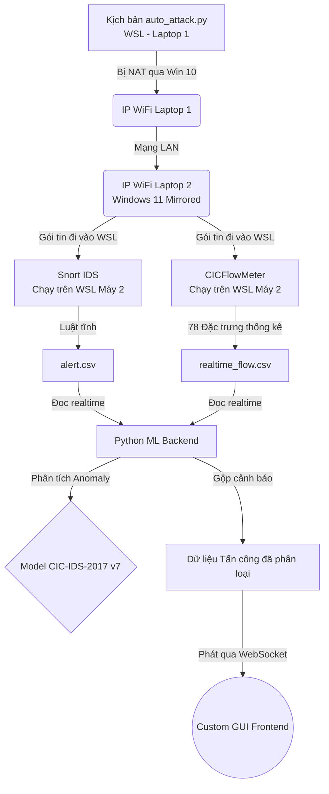

# Tích Hợp Kiến Trúc Hybrid IDS & 100% WSL

Kiến trúc này thiết lập một môi trường giả lập (Testbed) hoàn chỉnh, trong đó **Laptop 1 (Attacker)** sử dụng WSL trên Windows 10 để tấn công **Laptop 2 (Victim)** chạy WSL trên Windows 11. Ở lớp phòng thủ, hệ thống sử dụng mô hình **Hybrid IDS**, kết hợp giữa Snort (Signature-based) và CICFlowMeter nạp vào Model Machine Learning (Anomaly-based).

## 1. Cấu Trúc Mạng WSL Xuyên Máy Tính

- **Laptop 1 (Windows 10):** WSL nằm sau NAT mặc định. Khi WSL phát động tấn công, Windows 10 sẽ đứng ra làm Proxy (NAT) đẩy gói tin đi. Người phòng thủ (Máy 2) sẽ thấy mọi đợt tấn công xuất phát từ địa chỉ IP WiFi của Laptop 1.
- **Laptop 2 (Windows 11):** Cấu hình tính năng `mirrored` network cho WSL. Nhờ đó, WSL dùng chung trực tiếp địa chỉ IP vật lý của Laptop 2. Mọi traffic đánh vào IP WiFi của Laptop 2 sẽ bay thẳng vào WSL.



### 1.1. Thách Thức Đồng Bộ Nhãn (Label Synchronization)
Đây là thách thức kỹ thuật lớn nhất của kiến trúc Hybrid IDS. Timestamp của các cảnh báo (alert) từ Snort và timestamp của luồng (flow) trích xuất từ CICFlowMeter có thể bị lệch nhau vài giây do độ trễ xử lý.
**Giải pháp:** Module `Python ML Backend` cần phải có logic "join/match" thông minh theo **Time Window** (ví dụ: ± 2 giây) cùng với bộ 4 thông tin (Src IP, Dst IP, Src Port, Dst Port) để map chính xác nhãn "Tấn công" từ Snort vào đúng record dòng chảy của CICFlowMeter trước khi đưa vào mô hình học máy.

## 2. Các Bước Cài Đặt Khung Xương Hệ Thống

**Bước 2.1: Cấu hình Mạng cho Laptop 2 (Máy Nạn Nhân)**
Vì Windows 11 hỗ trợ `mirrored`, hãy tạo file `C:\Users\<Tên_User>\.wslconfig` trên Windows 11 với nội dung:
```ini
[wsl2]
networkingMode=mirrored
```
Khởi động lại WSL bằng lệnh `wsl --shutdown`. 

**Bước 2.2: Cài Đặt Công Cụ Bắt Gói Tin trên WSL (Laptop 2)**
Bên trong Terminal Ubuntu của Laptop 2, cài đặt Snort và CICFlowMeter:
```bash
# Cài đặt Snort
sudo apt update && sudo apt install snort -y

# Chạy CICFlowMeter (Cần biên dịch từ Github hoặc dùng bản compiled)
git clone https://github.com/ahlashkari/CICFlowMeter.git
# Lắng nghe card mạng
sudo ./cfm eth0 /var/log/cicflowmeter/
```

**Bước 2.3: Giới Hạn Công Cụ Tấn Công trên WSL (Laptop 1)**
Trên Laptop 1, do WSL bị giới hạn bởi NAT của Windows 10, lệnh Nmap mặc định (SYN Scan `-sS`) sẽ bị rớt gói tin. Mọi lệnh quét mạng bắt buộc phải chuyển sang chế độ TCP Connect (Thêm tham số `-sT`). Tôi đã cấu hình sẵn trong file `auto_attack.py` của bạn.
