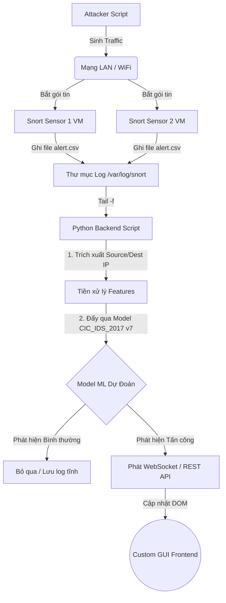

# Tích Hợp Snort Với Machine Learning Backend & Custom GUI

Vì bạn tự code GUI và có một Backend riêng dùng để chạy **Model ML v7 (CIC-IDS-2017)**, nên luồng dữ liệu (Data Pipeline) của hệ thống sẽ diễn ra theo thời gian thực (Real-time). Việc Snort được cài trên 2 máy ảo (đóng vai trò là Sensor) là một thiết kế phân tán rất tuyệt vời cho đồ án.

Dưới đây là thiết kế kiến trúc chuẩn để ghép nối 2 máy ảo Snort với Backend của bạn.

## 1. Cấu Hình Output Của Snort (Trên 2 Máy Ảo)

Để Backend Python của bạn đọc được cảnh báo từ Snort dễ dàng nhất, tuyệt đối không nên dùng định dạng `unified2` (rất khó parse). Hãy dùng định dạng **CSV** hoặc **JSON** (nếu dùng Snort 3).

**Cách 1: Nếu dùng Snort 2.x (Khuyên dùng output CSV)**
Mở file `snort.conf` trên cả 2 máy ảo, tìm dòng cấu hình output và thêm vào:
```text
# Xuất log ra file CSV để Backend dễ đọc bằng thư viện Pandas
output alert_csv: /var/log/snort/alert.csv default
```

**Cách 2: Nếu dùng Snort 3 (Khuyên dùng output JSON)**
Snort 3 hỗ trợ JSON native, cực kỳ dễ parse cho REST API và WebSocket:
```lua
alert_json = {
    file = true,
    limit = 100,
    fields = { 'timestamp', 'src_addr', 'src_port', 'dst_addr', 'dst_port', 'msg', 'class', 'priority' }
}
```

## 2. Luồng Hoạt Động (Data Pipeline)



## 3. Bản chất của Backend ML

Backend của bạn thực chất sẽ là một vòng lặp `while` liên tục theo dõi (tail) sự thay đổi của file log Snort. Mỗi khi Snort viết một dòng mới (có người tấn công), Backend lập tức:
1. Đọc dòng log đó (Lấy Source IP, Dest IP, Port, v.v.).
2. Gọi hàm `model.predict([features])`.
3. Nếu model xác nhận là `Malicious`, đẩy data qua WebSocket (`socket.io` / `FastAPI WebSocket`) lên Frontend.
4. Frontend nhận data, dùng thư viện (như `D3.js`, `Vis.js` hoặc `ECharts`) vẽ đường mũi tên đỏ chót từ Source IP đâm thẳng vào Dest IP.

*(Tôi đã soạn sẵn một file script mẫu `snort_ml_backend_example.py` trong thư mục scripts để bạn hình dung cách code đoạn đọc log và apply model này).*
