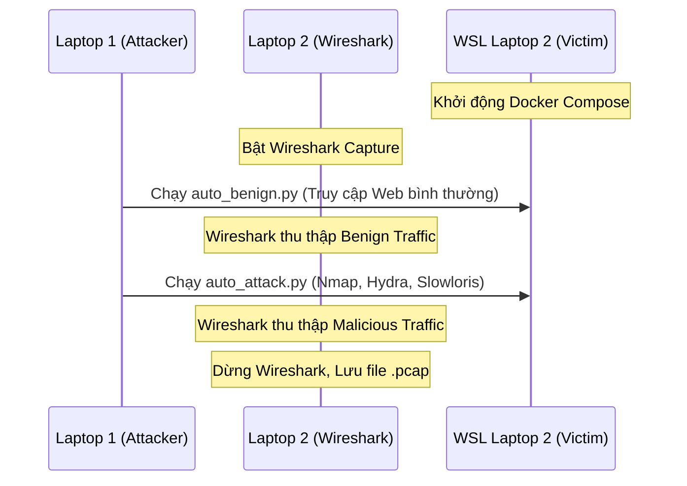

# Hướng Dẫn Vận Hành Testbed & Sinh Dữ Liệu

Tất cả các file cấu hình và mã nguồn cần thiết đã được tôi chuẩn bị sẵn sàng. Vì bạn đang làm việc trên 2 laptop vật lý khác nhau, bạn cần thực hiện copy các file này sang đúng máy theo hướng dẫn dưới đây.

Dưới đây là sơ đồ tóm tắt luồng hoạt động:


---

## Bước 1: Khởi động Nạn nhân trên Laptop 2 (Máy 3)

Bạn hãy lấy file `victim_docker_compose.yml` mà tôi vừa tạo và copy nó sang môi trường **WSL của Laptop 2**.

1. Đổi tên file thành `docker-compose.yml`.
2. Mở Terminal WSL trên Laptop 2, chạy lệnh:
   ```bash
   sudo docker-compose up -d
   ```
3. Lấy IP của mạng: Mở CMD/PowerShell trên Windows (Laptop 2) gõ lệnh `ipconfig`. Ghi lại địa chỉ **IPv4 Address** của card WiFi (Ví dụ: `192.168.1.55`). Đây chính là mục tiêu tấn công.

## Bước 2: Thiết lập Bộ Bắt Gói Tin trên Laptop 2 (Máy 2)

1. Đảm bảo bạn đã tắt **Windows Defender Firewall** (Phần Public network và Private network).
2. Mở phần mềm Wireshark trên Windows 11.
3. Nháy đúp vào **Card mạng WiFi** đang dùng để bắt đầu capture.

## Bước 3: Kích hoạt Tấn công trên Laptop 1 (Máy 1)

Bạn lấy 2 file script Python `auto_benign.py` và `auto_attack.py` copy sang môi trường **WSL của Laptop 1**.

1. Cài đặt thư viện Python (nếu chưa có):
   ```bash
   pip3 install requests slowloris
   ```
2. Mở cả 2 file script bằng trình soạn thảo (nano/vim/vscode), tìm dòng `VICTIM_IP = "192.168.x.x"` và sửa thành IP WiFi của Laptop 2 mà bạn đã lấy ở Bước 1.

**Thực thi:**
Mở 2 cửa sổ Terminal WSL trên Laptop 1:
- Cửa sổ 1 (Tạo dữ liệu Sạch): Chạy lệnh `python3 auto_benign.py`. Cứ để nó chạy ngầm.
- Cửa sổ 2 (Kích hoạt Tấn công): Chạy lệnh `python3 auto_attack.py`. Kịch bản này sẽ tự động chạy Nmap -> Dò pass Web -> Dò pass SSH -> Tấn công DoS bằng Slowloris.

## Bước 4: Thu thập và Kết thúc

1. Sau khi màn hình Terminal chạy `auto_attack.py` báo hoàn thành (khoảng 3-5 phút), bạn quay lại phần mềm Wireshark trên **Laptop 2**.
2. Nhấn nút Hình vuông màu đỏ (Stop capture).
3. Nhấn File -> Save As -> Đặt tên là `lan_attack_dataset_1.pcap`.

**Xin chúc mừng!** Bạn đã tự tạo thành công một bộ Dataset IDS của riêng mình có chứa cả lưu lượng bình thường và lưu lượng tấn công mạng LAN. Bạn có thể nạp file `.pcap` này vào CICFlowMeter để trích xuất đặc trưng CSV cho Machine Learning.
