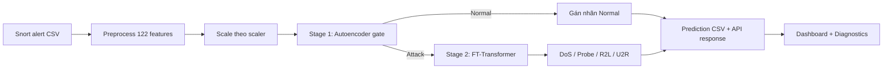
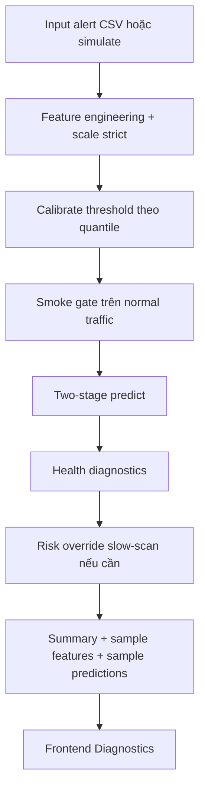
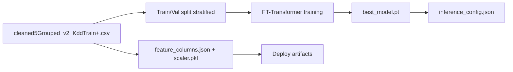
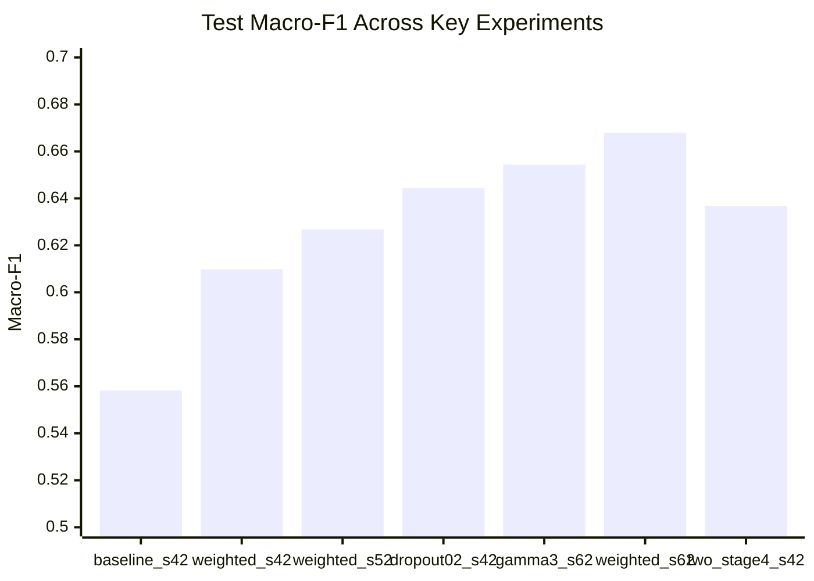
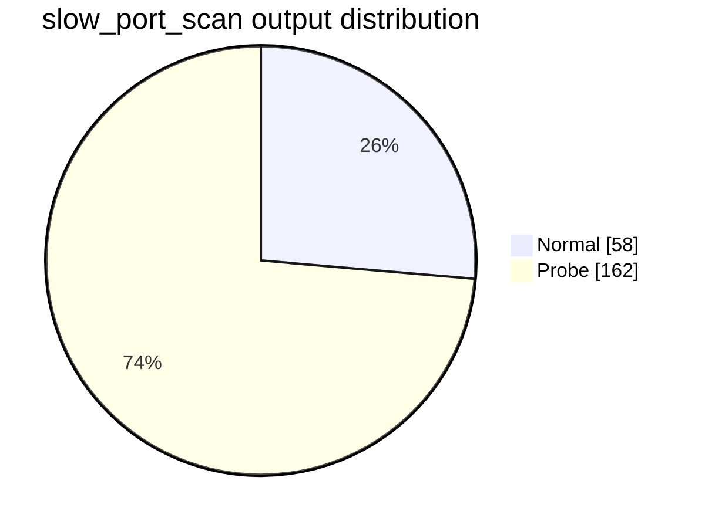

# BÁO CÁO TỔNG HỢP HIỆN TRẠNG HỆ THỐNG IDS

Cập nhật: 2026-06-10  
Phạm vi: Graduation-Thesis + IDS_Final_Product

---

## 1. Mục tiêu và phạm vi

Tài liệu này tổng hợp trạng thái hiện tại của đề tài, tập trung vào:
- Nội dung đã hoàn thành đến thời điểm hiện tại.
- Data pipeline đang vận hành.
- Thiết kế mô hình và thuật toán huấn luyện.
- Bảng và biểu đồ kết quả thực nghiệm.
- Tình trạng triển khai sản phẩm và các điểm cần hoàn thiện.

---

## 2. Tổng quan kiến trúc hệ thống hiện tại

### 2.1 Luồng runtime đã hardening (nhánh IDS_Final_Product)

---

## 3. Data pipeline hiện tại

## 3.1 Pipeline train (NSL-KDD)

## 3.2 Pipeline inference từ Snort

| Bước | Mô tả | Đầu ra |
|---|---|---|
| 1 | Đọc Snort alert CSV (timestamp, proto, src/dst, port, msg) | DataFrame sự kiện |
| 2 | Chuẩn hóa protocol/service/flag, suy diễn thống kê cửa sổ 2 giây | Feature rows thô |
| 3 | Align theo schema 122 cột (one-hot + numeric) | Vector 122 chiều |
| 4 | Scale theo scaler huấn luyện (nếu có / strict ở bản hardening) | Model-ready features |
| 5 | Two-stage inference | Nhãn + confidence + top-k + diagnostics |

Thông số schema chính:
- Số chiều feature: 122.
- Nhãn 5-class: Normal, DoS, Probe, R2L, U2R.

---

## 4. Thiết kế mô hình

## 4.1 Stage 1: Autoencoder (Anomaly Gate)

- Mục tiêu: Phân loại nhị phân Normal vs Attack bằng reconstruction error.
- Cấu trúc dense: 128 -> 64 -> 32 -> 16 -> 32 -> 64 -> 128.
- Train chủ yếu trên mẫu Normal.
- Threshold gốc trong hệ two-stage: 0.008481 (có bản runtime calibration trong nhánh hardening).

## 4.2 Stage 2: FT-Transformer

- Mục tiêu: Phân loại đa lớp tấn công (DoS, Probe, R2L, U2R) hoặc full 5-class theo cấu hình.
- Cấu hình baseline mạnh hiện tại (run seed62):
  - d_model: 128
  - num_heads: 8
  - num_layers: 4
  - d_ff: 512
  - dropout: 0.1
  - batch_size: 256
  - lr: 1e-4
  - weight_decay: 1e-4
  - focal gamma: 2.0
  - sampler: weighted

---

## 5. Thuật toán đã sử dụng trong train

| Nhóm kỹ thuật | Chi tiết sử dụng | Vai trò |
|---|---|---|
| Loss | Focal Loss, Label Smoothing Focal Loss | Giảm ảnh hưởng mất cân bằng lớp |
| Sampling | WeightedRandomSampler | Tăng tần suất học lớp hiếm |
| Data-level | SMOTE (tùy run) | Bù mẫu cho lớp hiếm |
| Regularization | Dropout, weight decay, gradient clipping | Giảm overfit, ổn định train |
| Augmentation | Mixup (tùy run) | Cải thiện khả năng tổng quát hóa |
| Scheduler | ReduceLROnPlateau / CosineAnnealingWarmRestarts | Điều chỉnh learning rate động |
| Early stop guard | Patience + train-val gap guard | Chặn overfitting theo độ lệch train/val |

---

## 6. Bảng tổng hợp kết quả thực nghiệm

## 6.1 Kết quả các run tiêu biểu (test set)

| Run | Thiết lập nổi bật | Test Accuracy | Test Macro-F1 |
|---|---|---:|---:|
| nslkdd_ft_baseline_seed42 | 1-stage, sampler none | 0.7477 | 0.5582 |
| nslkdd_ft_sampler_weighted_seed42 | 1-stage, weighted sampler | 0.7909 | 0.6098 |
| nslkdd_ft_sampler_weighted_seed52 | 1-stage, weighted sampler | 0.7707 | 0.6268 |
| nslkdd_ft_weighted_dropout02_seed42 | 1-stage, dropout 0.2 | 0.8058 | 0.6443 |
| v3_focal_gamma3_seed62 | 1-stage, gamma=3.0 | 0.7825 | 0.6544 |
| nslkdd_ft_sampler_weighted_seed62 | 1-stage, weighted sampler | 0.8005 | 0.6679 |
| v5_two_stage_4class_seed42 | Stage-2 attack-only (4 class) | 0.7974 | 0.6367 |

## 6.2 Biểu đồ Macro-F1 theo run

## 6.3 Per-class F1 (mốc chính)

| Class | Baseline 5-class | Best 1-stage (seed62) | Two-stage Stage-2 (4-class) |
|---|---:|---:|---:|
| DoS | 0.8721 | 0.8871 | 0.8944 |
| Probe | 0.6394 | 0.6824 | 0.7041 |
| R2L | 0.2804 | 0.5094 | 0.5959 |
| U2R | 0.2316 | 0.4252 | 0.3525 |

Lưu ý: Cột Two-stage Stage-2 là bài toán 4-class attack-only, không gồm lớp Normal.

## 6.4 Biểu đồ cải thiện lớp hiếm (R2L, U2R)

```mermaid
xychart-beta
    title "Minority-Class F1 Improvement"
    x-axis [R2L, U2R]
    y-axis "F1" 0.20 --> 0.65
    bar [0.2804, 0.2316]
    bar [0.5094, 0.4252]
    bar [0.5959, 0.3525]
```

Diễn giải thứ tự 3 cột mỗi nhãn: Baseline -> Best 1-stage -> Two-stage Stage-2.

---

## 7. Trạng thái triển khai sản phẩm

## 7.1 Thành phần đã có

| Thành phần | Trạng thái | Ghi chú |
|---|---|---|
| Snort + logging CSV | Hoàn thành | Có cấu hình và log mẫu |
| Preprocess 122 features | Hoàn thành | Chạy được từ alert CSV |
| FT-Transformer 1-stage | Hoàn thành | Có package đầy đủ artifacts |
| Two-stage inference | Hoàn thành bản chính | Có Autoencoder + FT checkpoint |
| Backend API | Hoàn thành | /api/health, /api/simulate, /api/detect |
| Frontend Dashboard | Hoàn thành | Có bảng kết quả, diagnostics |
| Hardening runtime | Hoàn thành ở IDS_Final_Product | calibration + smoke gate + risk override |

## 7.2 Điểm cần chú ý khi demo/bảo vệ

- Trong nhánh final/two_stage_v5 đang thiếu scaler kèm package; bản IDS_Final_Product đã chặt chẽ hơn về kiểm tra artifacts.
- Kết quả Stage-2 4-class cần trình bày đúng bối cảnh (attack-only), không so trực tiếp tuyệt đối với mọi chỉ số 5-class có Normal.
- Nên báo cáo song song cả chỉ số tổng (macro-F1) và lớp hiếm (R2L/U2R).

---

## 8. Kết quả smoke test hardening (09/06/2026)

| Scenario | predicted_counts | mean_confidence | stage1_normal_gate_rate | slow_attack_ratio | risk_override |
|---|---|---:|---:|---:|---|
| normal | {Normal:159, Probe:1} | 0.6621 | 0.99375 | - | false |
| slow_port_scan | {Normal:58, Probe:162} | 0.5445 | - | 0.7364 | true (count=162) |

---

## 9. Kế hoạch hoàn thiện tiếp theo

1. Hợp nhất nhánh hardening vào pipeline chính để tránh lệch runtime giữa hai cây mã.
2. Bổ sung test regression tự động cho 3 kịch bản: normal, mixed, slow_port_scan.
3. Re-train Stage-1/Stage-2 trên dữ liệu gần domain Snort thực tế để giảm phụ thuộc heuristic override.
4. Chuẩn hóa gói phát hành cuối cùng gồm đầy đủ checkpoint, scaler, feature schema, config, checksum.

---

## 10. Nguồn dữ liệu tham chiếu chính

- final/primary_pipeline.json
- final/snort_preprocess_122.py
- final/snort_ft_transformer_inference_v5.py
- final/FINAL_PRODUCT_REPORT.md
- final/BAO_CAO_TIEN_DO_THEO_KE_HOACH.md
- MLAnomalyDetection/train_ft_transformer_nslkdd.py
- MLAnomalyDetection/phase2_ft_transformer.py
- MLAnomalyDetection/outputs/nslkdd_ft_experiments/*/results/training_summary.json
- MLAnomalyDetection/outputs/nslkdd_ft_experiments/*/results/per_class_metrics.csv
- IDS_Final_Product/backend/app/main.py
- IDS_Final_Product/backend/app/pipeline_service.py
- IDS_Final_Product/inference/snort_two_stage_inference.py
- work_session_logs/2026-06-09/session-02.md
