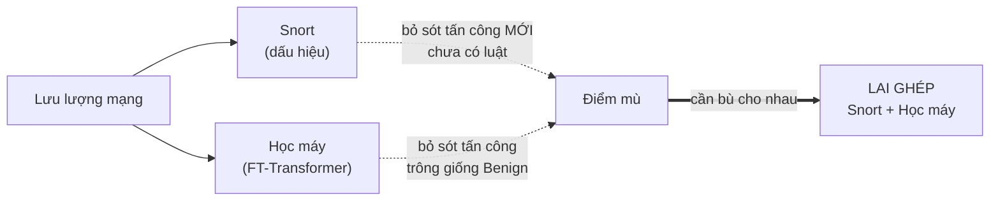
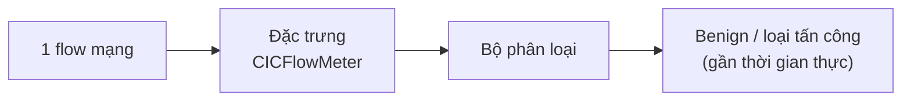
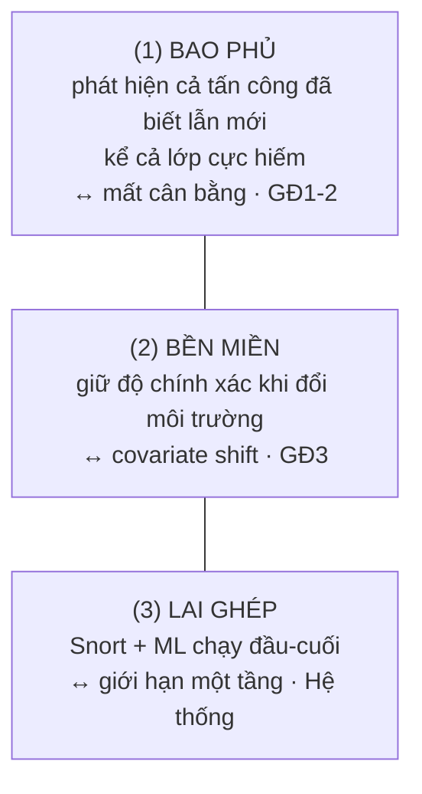
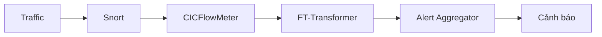
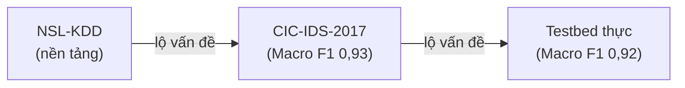
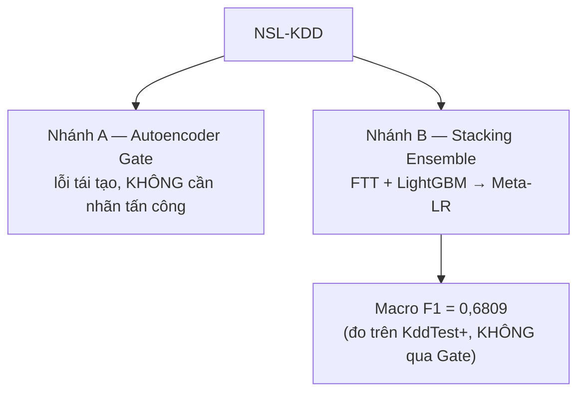
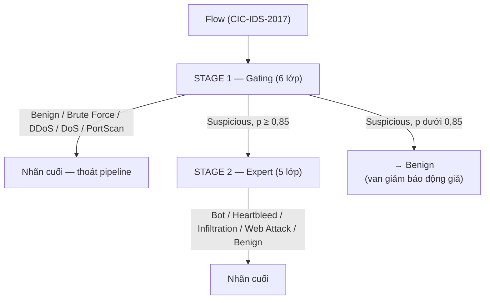
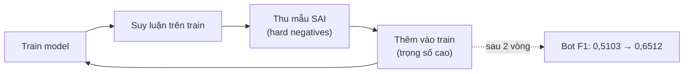
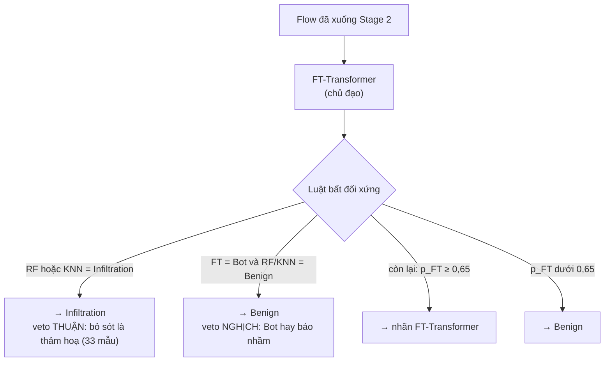
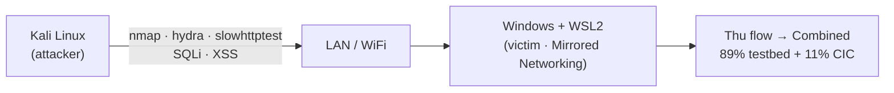

# SLIDE BẢO VỆ — NỘI DUNG · SCRIPT · HÌNH/BẢNG (bản đã sửa theo code/checkpoint thật)

> **Đề tài:** Phát triển hệ thống phát hiện tấn công mạng bằng phát hiện bất thường
> *(cách tiếp cận: lai ghép Snort + FT-Transformer)*
>
> **File này dùng để làm gì:** mỗi slide có đủ 3 khối — (1) **Nội dung on-slide** (chữ hiện trên slide, đã rút gọn),
> (2) **Script** (lời nói, ngôi "em" trước hội đồng), (3) **Hình/Bảng** (gợi ý biểu đồ/sơ đồ). Bạn tự dựng PPT từ đây.
>
> **Nguồn chuẩn:** đã đối chiếu **code + checkpoint thật** (đọc shape weight, encoder pickle), KHÔNG chép theo quyển ở
> những chỗ quyển sai. Xem `giải thích lý thuyết/doi-chieu-model-do-an-vs-code.md` và `.../BAN-TONG-HOP-BAO-VE-3-GIAI-DOAN.md`.
>
> **Ràng buộc:** 19 slide chính + phụ lục · template HUST 4×3 · 12–15 phút · mỗi slide ≤ 6 dòng · không từ tuyệt đối
> ("nhất", "triệt để") · demo ghi rõ **replay ≠ live**.
>
> **Ký hiệu:** `[CẦN VERIFY]` = con số/khẳng định chưa đối chiếu được với checkpoint → bạn tự kiểm trước khi in.

---

## ⏱️ Ngân sách thời gian (mục tiêu ~15–16 phút — bấm giờ; nếu vượt 15, gọt bớt phần Phương pháp)

| Slide | 1 | 2 | 3 | 4 | 5 | 6 | 7 | 8 | 9 | 10 | 11 | 12 | 13 | 14 | 15 | 16 | 17 | 18 | 19 |
|---|---|---|---|---|---|---|---|---|---|---|---|---|---|---|---|---|---|---|---|
| Phút | 0:15 | 0:20 | 0:50 | 0:40 | 1:00 | 0:50 | 1:00 | 1:10 | 1:20 | 0:50 | 1:10 | 1:20 | 1:00 | 1:00 | 0:50 | 1:00 | 0:50 | 0:50 | 0:10 |

**KHÔNG cắt:** Slide 12 (covariate shift) và Slide 15 (bổ sung Snort↔ML) — hai đóng góp lõi.

## 🎨 Quy ước hình thức (áp dụng toàn bộ)

- **3 màu giai đoạn xuyên suốt:** GĐ1 xám-xanh · GĐ2 xanh dương · GĐ3 cam (lặp ở Slide 5, 7, 8, 9, 12, 17).
- Màu **xanh lá** cho số đạt mục tiêu (0,9294 · 0,917); màu **đỏ/cam** cho số sụt (21,93% · MCC −0,015 · 6,87%).
- 3 icon thách thức: ⚖️ mất cân bằng · 🔀 covariate shift · 🧩 giới hạn một tầng.
- **Kicker (eyebrow) mỗi slide nội dung:** một dòng nhỏ trên tiêu đề ghi `Mục X · <tên mục lục>` để hội đồng luôn biết đang ở phần nào — **khớp 1-1 với 5 mục ở Slide 2**.

## 🏷️ Quy ước tên model (số version nội bộ CHỈ ở phụ lục)

- **GĐ1 (NSL-KDD) — "Ensemble nền tảng":** AE-Gate + FT-Transformer + LightGBM + Meta-LR.
- **GĐ2 (CIC-IDS-2017) — "Two-Stage Cascade":** Gating (Stage 1) + Expert (Stage 2) + RF + KNN.
- **GĐ3 (Testbed) — "FT-IDS":** mô hình FT-Transformer triển khai, 80 đặc trưng ← **tên chính dùng trên slide**.
- **FT-Transformer / FTT** = *kiến trúc* dùng xuyên suốt (không phải tên riêng của model nào); **FT-IDS** là bản triển khai cuối của kiến trúc này.
- **Số version KHÔNG lên slide chính** (chỉ phụ lục / khi bị hỏi): FT-IDS = V8.5 *(lineage V8.1–V8.4)* · Cascade = V7 *(chuỗi V5→V6→V7)*.

---
---

# SLIDE 1 — TRANG BÌA

### Nội dung on-slide
- **Phát triển hệ thống phát hiện tấn công mạng bằng phát hiện bất thường**
- Sinh viên: **Đỗ Tuấn Minh** — MSSV **20225741** — Lớp **Việt Nhật 07**, Trường CNTT & Truyền thông
- GVHD: **PGS.TS. Nguyễn Linh Giang**
- *[Địa điểm · Tháng, Năm bảo vệ]*

### Script (~15s — KHÔNG đọc nguyên bìa)
> "Kính thưa hội đồng, em là Đỗ Tuấn Minh. Hôm nay em xin trình bày đồ án *Phát triển hệ thống phát hiện tấn công
> mạng bằng phát hiện bất thường*, dưới sự hướng dẫn của thầy Nguyễn Linh Giang. Em xin phép bắt đầu."

### Hình/Bảng
- Logo HUST (có sẵn trong template). Không nhồi chữ.
- ⚠️ Soát chính tả tên đề tài + tên GVHD (chỗ dễ bị soi nhất).

---

# SLIDE 2 — NỘI DUNG TRÌNH BÀY

### Nội dung on-slide
1. **Vấn đề — Bài toán — Mục tiêu** *(Slide 3–4)*
2. **Ba thách thức cốt lõi** *(Slide 5)*
3. **Phương pháp — 3 giai đoạn nghiên cứu** *(Slide 6–14)*
4. **Kết quả thực nghiệm** *(Slide 15–16)*
5. **Kết luận & Hướng phát triển** *(Slide 17–19)*

### Script (~20s)
> "Phần trình bày của em gồm 5 mục: vấn đề, bài toán và mục tiêu; ba thách thức cốt lõi; phương pháp qua ba giai đoạn
> nghiên cứu; kết quả thực nghiệm; và cuối cùng là kết luận. Trọng tâm nằm ở mục 3 và 4."

### Hình/Bảng
- Thanh tiến trình ngang 5 bước; highlight mục 3 & 4.

---

# SLIDE 3 — VẤN ĐỀ & BÀI TOÁN

> **Kicker on-slide:** `Mục 1 · Vấn đề & Bài toán`

### Nội dung on-slide
- **Vấn đề:**
  - Tấn công mạng ngày càng nhiều & tinh vi; **phát hiện muộn** gây thiệt hại lớn.
  - Lưu lượng vừa có **biến thể của tấn công đã biết**, vừa có **hành vi bất thường chưa từng thấy**.
  - **Mỗi cách đơn lẻ đều có điểm mù:** dấu hiệu (Snort) bỏ sót cái mới; học máy bỏ sót cái "giống Benign".
- **Bài toán (NIDS):**
  - Đầu vào: mỗi *flow* mạng (đặc trưng thống kê CICFlowMeter) → Đầu ra: **Benign / loại tấn công**.
  - Ràng buộc: **gần thời gian thực**, chạy được trên **hạ tầng phổ thông** (không cần máy chủ mạnh).

### Script (~50s)
> "Trước hết là **vấn đề**. Tấn công mạng ngày càng nhiều và tinh vi, và điều nguy hiểm là chúng thường bị phát hiện
> muộn, gây thiệt hại lớn. Về bản chất, lưu lượng mạng đặt ra một khó khăn kép: vừa có những **biến thể của tấn công
> đã biết**, vừa có những **hành vi bất thường chưa từng xuất hiện**. Và mỗi cách tiếp cận đơn lẻ đều có điểm mù —
> hệ dựa trên dấu hiệu như Snort bỏ sót cái mới chưa có luật, còn hệ học máy lại bỏ sót những tấn công trông giống
> lưu lượng bình thường. Từ đó, **bài toán** em giải là phát hiện xâm nhập mạng — NIDS: đầu vào là từng luồng mạng,
> mỗi *flow* được mô tả bằng các đặc trưng thống kê từ CICFlowMeter; đầu ra là phân loại flow đó là bình thường hay
> thuộc loại tấn công nào. Có hai ràng buộc quan trọng: phải chạy **gần thời gian thực**, và chạy được trên **hạ tầng
> phổ thông** chứ không cần máy chủ mạnh."

### Hình/Bảng
- Sơ đồ nhỏ **"2 điểm mù"**: Snort (bỏ sót cái mới) ⟷ ML (bỏ sót cái giống Benign) → gợi ý phải **lai ghép**.
- Sơ đồ bài toán 1 dòng: `flow → [đặc trưng CICFlowMeter] → phân loại → Benign / tấn công`.
- Giữ giọng khái quát — chưa cần số liệu cụ thể ở đây (số dồn sang Slide 5 & phần kết quả).

---

# SLIDE 4 — MỤC TIÊU

> **Kicker on-slide:** `Mục 1 · Mục tiêu`

### Nội dung on-slide
- **(1) Bao phủ:** phát hiện tốt **cả tấn công đã biết lẫn bất thường mới** — kể cả **lớp cực hiếm** *(↔ mất cân bằng)*.
- **(2) Bền miền:** **giữ độ chính xác** khi rời dữ liệu chuẩn sang **môi trường thực** *(↔ covariate shift)*.
- **(3) Lai ghép:** kết hợp **Snort + học máy** thành **hệ thống chạy đầu-cuối**, bù điểm mù cho nhau.
- *└ Tiêu chí định lượng:* **Macro F1 > 0,9** trên **CIC-IDS-2017** và **testbed thực**.
- *3 mục tiêu ↔ 3 giai đoạn ↔ đối chiếu "Đạt" ở Slide 17.*

### Script (~40s)
> "Từ bài toán đó, em đặt ra **ba mục tiêu**, mỗi mục tiêu gắn với một thách thức. Một là **bao phủ**: phát hiện tốt
> cả tấn công đã biết lẫn bất thường mới, kể cả những lớp **cực hiếm** chỉ vài chục mẫu — đây là bài toán mất cân
> bằng. Hai là **bền miền**: giữ được độ chính xác khi rời khỏi dữ liệu chuẩn để sang môi trường thật — tức chống
> covariate shift. Ba là **lai ghép**: kết hợp Snort với học máy thành một hệ thống chạy đầu-cuối, để hai tầng bù
> điểm mù cho nhau. Về mặt định lượng, em đặt mốc **Macro F1 trên 0,9** trên cả bộ chuẩn CIC-IDS-2017 và testbed
> thật. Ba mục tiêu này ứng với ba giai đoạn nghiên cứu, và em sẽ đối chiếu 'Đạt' ở cuối bài."

### Hình/Bảng
- 3 khối mục tiêu tô **3 màu giai đoạn** (GĐ1/GĐ2/GĐ3) để gợi ánh xạ mục tiêu ↔ giai đoạn.
- Dòng "Macro F1 > 0,9" để cỡ nhỏ hơn, như chú thích tiêu chí.
- Slide này **"khép vòng"** với Slide 17 (đối chiếu mục tiêu): giữ ánh xạ 1-1 — (1) ↔ CIC, (2) ↔ testbed, (3) ↔ hybrid.

---

# SLIDE 5 — BA THÁCH THỨC CỐT LÕI

> **Kicker on-slide:** `Mục 2 · Ba thách thức cốt lõi` — *(slide bản lề cả bài)*

### Nội dung on-slide
- ⚖️ **Mất cân bằng cực đoan** — Benign 80–99%; lớp hiếm **Heartbleed chỉ 10 mẫu**
- 🔀 **Covariate shift** — CIC 99,55% → Testbed WSL2 **21,93%**
- 🧩 **Giới hạn một tầng** — Snort bỏ sót zero-day; ML bỏ sót tấn công "giống Benign"
- *→ Mỗi thách thức được giải bởi đúng một giai đoạn.*

### Script (~60s)
> "Cả đồ án xoay quanh ba thách thức. Thứ nhất, **mất cân bằng cực đoan**: trong dữ liệu, lớp Benign chiếm 80 đến
> 99%, trong khi lớp hiếm nhất — Heartbleed — chỉ có **10 mẫu**. Thứ hai, **covariate shift**: một mô hình đạt
> 99,55% trên CIC, khi đưa sang môi trường thật của em thì tụt xuống 21,93% — em sẽ phân tích kỹ ở phần sau. Thứ ba,
> **giới hạn của một tầng đơn**: Snort dựa trên dấu hiệu nên bỏ sót tấn công chưa có luật, còn mô hình học máy lại
> bỏ sót tấn công trông giống lưu lượng bình thường. Điểm mấu chốt: **mỗi thách thức được giải bởi đúng một giai
> đoạn** trong ba giai đoạn nghiên cứu của em."

### Hình/Bảng
- `fig_cic_imbalance.png` — bar chart **log-scale** minh hoạ mất cân bằng, đặt cạnh khối ⚖️.
- 3 icon = 3 màu giai đoạn (sẽ lặp lại). Con số 21,93% để cỡ lớn, màu đỏ.
- ⚠️ [CẦN VERIFY] Nếu muốn giữ tỉ lệ "Benign:lớp hiếm = X:1", đối chiếu lại số thật; tài liệu chỉ xác nhận
  **Heartbleed 10 mẫu** là mốc cực đoan an toàn để nói (không dùng "65.000:1" nếu chưa tìm ra nguồn).

---

# SLIDE 6 — VÌ SAO CHỌN FT-TRANSFORMER

> **Kicker on-slide:** `Mục 3 · Phương pháp`

### Nội dung on-slide

| Hướng | Ưu | Nhược |
|---|---|---|
| Signature (Snort) | Nhanh, chính xác với tấn công đã biết | Bỏ sót zero-day / không dấu hiệu |
| ML/cây (RF, LightGBM) | Mạnh trên dữ liệu bảng | **Không "phẫu thuật" được để thêm đặc trưng** |
| **FT-Transformer** | Attention học tương tác đặc trưng + **Model Surgery** | Hộp đen, cần đủ dữ liệu |

- **Chốt:** chọn FTT **không phải vì "mạnh nhất"** — trên dữ liệu bảng cây vẫn rất khỏe — mà vì nó cho phép **ghép thêm
  đặc trưng và đóng băng chọn lọc** khi chuyển miền. Đó là thứ cứu giai đoạn 3.

### Script (~50s)
> "Vì sao em chọn FT-Transformer làm xương sống? Em xin nói thẳng một điều trung thực: **không phải vì nó mạnh nhất**.
> Trên dữ liệu dạng bảng, các mô hình cây như LightGBM vẫn rất khỏe — ở giai đoạn 1 LightGBM còn **thắng**
> FT-Transformer. Lý do thật sự em chọn Transformer nằm ở kiến trúc: nó mã hoá **mỗi đặc trưng thành một token
> riêng**, nhờ đó em có thể **ghép thêm đặc trưng mới mà không phải train lại từ đầu**, và **đóng băng có chọn lọc**
> từng đặc trưng khi thích nghi môi trường mới. Cây và MLP không làm được điều đó. Và đúng hai khả năng này là thứ
> cứu em ở giai đoạn 3, khi dữ liệu thật rất ít. Em không loại bỏ cây — em **kết hợp** chúng trong ensemble."

### Hình/Bảng
- (tuỳ chọn) icon Attention nối 3 đặc trưng → 1 nhãn; hoặc sơ đồ nhỏ "token-per-feature → ghép thêm 1 token".
- ⚠️ Phải **hiểu** ô "Model Surgery" — hội đồng chắc chắn hỏi "vì sao không MLP/cây". Câu trả lời nằm ở token độc lập.

---

# SLIDE 7 — KIẾN TRÚC TỔNG QUAN (Pipeline + 3 giai đoạn)

> **Kicker on-slide:** `Mục 3 · Phương pháp`

### Nội dung on-slide
- **Pipeline End-to-End:** `Traffic → Snort → CICFlowMeter → FT-Transformer → Alert Aggregator → Cảnh báo`
- **Mạch 3 giai đoạn:** `NSL-KDD (nền tảng) → CIC-IDS-2017 (Macro F1 0,93) → Testbed thực (Macro F1 0,92)`
- Chú thích mũi tên: *"kết quả GĐ trước lộ vấn đề GĐ sau"*
- **3 giai đoạn ≠ 3 lần train lại:** 2 lần đầu train từ đầu, **giai đoạn 3 là fine-tune** (kế thừa backbone GĐ2)

### Script (~60s)
> "Đây là bức tranh lớn. Tầng trên là hệ thống chạy thật đầu-cuối: lưu lượng đi qua Snort để bắt dấu hiệu, qua
> CICFlowMeter để trích đặc trưng, rồi FT-Transformer phân loại, cuối cùng gom lại thành cảnh báo. Tầng dưới là
> **mạch nghiên cứu ba giai đoạn**: NSL-KDD làm nền tảng, CIC-IDS-2017 để kiểm chứng ở quy mô lớn, và testbed thật
> để triển khai. Em xin nhấn mạnh một điểm hay bị hiểu nhầm: **ba giai đoạn không phải ba lần train lại cùng một mô
> hình**. Chỉ hai giai đoạn đầu train từ đầu — và buộc phải tách rời vì không gian đặc trưng khác hẳn nhau. **Giai
> đoạn ba là fine-tune**: nó nạp lại trọng số của giai đoạn hai rồi ghép thêm đặc trưng. Đó là *transfer learning*,
> không phải huấn luyện lại."

### Hình/Bảng
- Sơ đồ tự vẽ 2 tầng (SmartArt/hình khối), dùng 3 màu giai đoạn cho 3 khối dưới, ≤ 6 khối mỗi tầng.
- Tuỳ chọn `fig_theory_linkage.png` phụ hoạ (hoặc để phụ lục).

---

# SLIDE 8 — GIAI ĐOẠN 1: MÔ HÌNH NỀN TẢNG (NSL-KDD)

> **Kicker on-slide:** `Mục 3 · Phương pháp · Giai đoạn 1`

### Nội dung on-slide
- Hai nhánh **tách biệt** (không gộp làm một mạch):
  - **Autoencoder Anomaly Gate** — lọc bất thường bằng lỗi tái tạo (không cần nhãn tấn công)
  - **Stacking Ensemble** — FTT + LightGBM → Meta-LR
- **Kết quả 0,6809 = từ Stacking 5 lớp**, đo trên KddTest+ tách biệt — **KHÔNG đi qua AE Gate**
- Trung thực: FTT đơn lẻ **thua** LightGBM (0,6535 vs 0,6678); soft-voting thất bại (α*=1,0) → chỉ Stacking mới thắng
- Lớp hiếm recall thấp = **giới hạn cứng của dataset**, không phải lỗi mô hình → lý do chuyển sang CIC

### Script (~70s)
> "Giai đoạn một trả lời câu hỏi khả thi: FT-Transformer — vốn sinh ra cho ngôn ngữ — có ăn được dữ liệu dạng bảng
> của IDS không? Em xây hai thành phần. Một là **Autoencoder Gate**: nó học nén rồi tái tạo lưu lượng bình thường,
> gặp thứ lạ thì tái tạo dở, lỗi cao, đánh dấu đáng ngờ — không cần nhãn tấn công. Hai là **Stacking Ensemble** kết
> hợp FT-Transformer với LightGBM qua một bộ meta học cách gộp. Em xin báo cáo trung thực: FT-Transformer **đơn lẻ
> thua** LightGBM, 0,65 so với 0,67. Trung bình có trọng số cũng **thất bại** — tối ưu lại rơi về chỉ dùng LightGBM.
> Chỉ khi cho một bộ meta **học cách kết hợp** thì mới vượt cả hai, đạt Macro F1 **0,6809**. Xin lưu ý con số này đến
> từ **nhánh Stacking**, không đi qua Gate — em trình bày tách bạch để chính xác. Recall lớp hiếm thấp là giới hạn
> của chính bộ NSL-KDD, và đó là lý do em chuyển sang CIC ở giai đoạn hai. Nhưng thứ giá trị nhất giai đoạn một bàn
> giao **không phải con số, mà là quyết định kiến trúc Feature Tokenizer** — thứ cho phép *Model Surgery* về sau."

### Hình/Bảng
- `fig_nslkdd_perclass.png` (per-class) hoặc `fig_nslkdd_ablation.png`.
- Sơ đồ nhỏ 2 nhánh **tách rời** (Gate | Stacking) để không gợi ý chúng là 1 pipeline nối tiếp.
- ⚠️ [CẦN VERIFY] "Lớp hiếm" là **R2L (telnet→pop3)** hay **U2R (chỉ ~5 mẫu val)**? Tài liệu nhấn **U2R** là ceiling;
  slide cũ ghi R2L. Chọn đúng lớp trước khi in.
- ⚠️ Định vị GĐ1 là **nền tảng lấy số liệu & xác định ceiling**, KHÔNG khoe là "hệ thống triển khai".

---

# SLIDE 9 — GIAI ĐOẠN 2: TWO-STAGE CASCADE (CIC-IDS-2017)

> **Kicker on-slide:** `Mục 3 · Phương pháp · Giai đoạn 2`

### Nội dung on-slide
- **Stage 1 — Gating (6 lớp):** Benign + 4 tấn công đông (Brute Force, DDoS, DoS, PortScan) + nhãn gom **Suspicious**
- Nhánh Suspicious có **p ≥ 0,85** → xuống Stage 2; **p < 0,85 → ép về Benign** *(van giảm báo động giả)*
- **Stage 2 — Expert (5 lớp):** chuyên gia lớp hiếm — Benign + Bot + Heartbleed + Infiltration + Web Attack
- **Vì sao 2 tầng:** lớp đông xử lý ở tầng 1 → gradient lớp hiếm ở tầng 2 **không bị hàng trăm nghìn flow lấn át**

### Script (~80s)
> "Giai đoạn hai kiểm chứng ở quy mô 2,5 triệu flow và mất cân bằng cực đoan. Em dùng kiến trúc **hai tầng nối
> tiếp**. Tầng một — *Gating* — **tự phân luôn sáu lớp**: Benign, cùng bốn loại tấn công phổ biến là Brute Force,
> DDoS, DoS, PortScan, và một nhãn gom *Suspicious* cho những gì chưa chắc. Chỉ những flow bị nghi ngờ **với độ tin
> cậy từ 85% trở lên** mới được đẩy xuống tầng hai; còn dưới ngưỡng đó thì **coi là Benign**. Em xin nói rõ đúng bản
> chất: ngưỡng 0,85 này là **van giảm báo động giả** — chỉ ca thật sự đáng ngờ mới chuyển chuyên khoa, chấp nhận đánh
> đổi một chút recall lấy precision. Tầng hai — *Expert* — nhỏ hơn, chỉ **năm lớp**, chuyên trị **các lớp hiếm**:
> Bot, Heartbleed, Infiltration, Web Attack. Vì sao tách hai tầng? Vì nếu để chung, gradient của mấy lớp hiếm vài
> chục mẫu sẽ bị các lớp hàng trăm nghìn flow **đè bẹp**. Tách ra, lớp hiếm ở tầng hai chỉ còn cạnh tranh **trong
> nhóm lớp hiếm** — đó là toàn bộ lý do cascade hoạt động."

### Hình/Bảng
- Sơ đồ Two-Stage tự vẽ: `Traffic → Stage 1 (6 lớp) → {Benign & 4 tấn công đông thoát} / {Suspicious, p≥0,85} → Stage 2 (5 lớp)`.
  Nhánh `p < 0,85 → Benign` vẽ mũi tên phụ.
- ⚠️ **BỎ số "1-Stage 0,7831 → Two-Stage 0,8817"** — 0,7831 không có nguồn trong repo. Nếu cần ablation, **để ở phụ lục**
  (chuỗi cải tiến nội bộ V5→V6→V7 = 0,6065 → 0,9160 → 0,9294 — KHÔNG lên slide chính).
- ⚠️ Đừng ghi "Gating nhị phân" hay "Expert 9 lớp" — đó là bản quyển sai. Checkpoint: Stage 1 = 6, Stage 2 = 5.

---

# SLIDE 10 — GIAI ĐOẠN 2: HARD NEGATIVE MINING CHO LỚP HIẾM

> **Kicker on-slide:** `Mục 3 · Phương pháp · Giai đoạn 2`

### Nội dung on-slide
- Ý tưởng: thu mẫu **phân loại sai** → thêm vào train (trọng số cao) → lặp **2 vòng**
- **Botnet F1: class weight ×10 → 0,5103 → HNM 2 vòng → 0,6512** *(hơn ~14 điểm tuyệt đối)*
- Thông điệp: **tăng gradient vào biên quyết định** hiệu quả hơn tăng class weight đều tay

### Script (~50s)
> "Với các lớp hiếm, em dùng **Hard Negative Mining**. Ý tưởng: cho mô hình chạy, thu lại đúng những mẫu **nó phân
> loại sai** — những ca khó nằm sát biên quyết định — rồi đưa chúng trở lại tập train và lặp hai vòng. Em so sánh
> trực tiếp với cách thông thường là **nhân trọng số lớp lên gấp mười**: cách đó chỉ đưa Botnet lên F1 0,51, còn Hard
> Negative Mining đưa lên **0,65** — hơn khoảng 14 điểm tuyệt đối. Bài học ở đây: **dồn sức vào ranh giới quyết định
> hiệu quả hơn là tăng trọng số đều tay cho cả lớp**."

### Hình/Bảng
- `fig_hnm_ablation.png` (bar so sánh class-weight vs HNM). Vẽ vòng lặp 4 bước: train → infer → thu hard neg → retrain.
- ⚠️ [CẦN VERIFY] Slide cũ ghi *"Botnet 0,4787 → 0,6512 (+36%)"* và *"Infiltration 0,3821 → 0,5903 (+54,5%)"*.
  Tài liệu chốt số khác: **class weight ×10 → Bot 0,5103 → HNM 0,6512**. Các mốc 0,4787 / 0,3821 / 0,5903 **chưa
  xác minh** — soát lại với báo cáo/log trước khi in. Nếu không chắc, chỉ dùng cặp số Botnet đã verify ở trên.

---

# SLIDE 11 — GIAI ĐOẠN 2: ASYMMETRIC ENSEMBLE VOTING & KẾT QUẢ

> **Kicker on-slide:** `Mục 3 · Phương pháp · Giai đoạn 2`

### Nội dung on-slide
- Ensemble = **FTT chủ đạo + RF/KNN đóng vai VETO** *(không phải majority vote)*
- **Infiltration (veto thuận):** RF *hoặc* KNN nói Infiltration → nhận ngay — vì bỏ sót là thảm họa (33 mẫu)
- **Bot (veto nghịch):** nếu RF *hoặc* KNN nói Benign → **hạ Bot về Benign** — vì Bot hay báo nhầm
- Lớp còn lại: lấy nhãn FTT nếu **p ≥ 0,65**, dưới ngưỡng → Benign
- **Kết quả GĐ2: Accuracy 99,55% · Macro F1 = 0,9294 → Đạt mục tiêu 1** · Infiltration 0,7407 · Bot 0,7344

### Script (~70s)
> "Ở tầng hai, em không dùng một mô hình đơn mà kết hợp ba: FT-Transformer, Random Forest và KNN — chúng sai trên
> những mẫu khác nhau nên bổ sung cho nhau. Nhưng cách kết hợp của em **không phải bỏ phiếu đa số** — mà là **bất
> đối xứng**, vì chi phí sai của mỗi lớp là khác nhau. FT-Transformer làm chủ; Random Forest và KNN chỉ có **quyền
> phủ quyết** cho đúng hai lớp. Với **Infiltration** — cực hiếm, chỉ 33 mẫu, bỏ sót là thảm hoạ — em hạ ngưỡng tối
> đa: chỉ cần **một trong hai** mô hình nói Infiltration là nhận. Ngược lại với **Bot** — vốn hay báo nhầm — nếu một
> trong hai nói đó là Benign thì em **hạ xuống Benign**. Ví như bệnh hiểm nghèo thì một bác sĩ nghi là phải sinh
> thiết, còn cảm cúm thì cần cả nhóm đồng ý mới cho nghỉ. Kết quả cuối giai đoạn hai: **Accuracy 99,55%, Macro F1
> 0,9294** — đạt mục tiêu thứ nhất."

### Hình/Bảng
- `fig_ensemble_compare.png` (so sánh các luật voting). Sơ đồ: FTT ở giữa, RF/KNN là 2 công tắc veto cho Bot & Infiltration.
- Khối "0,9294 → Đạt mục tiêu 1" tô **xanh lá**.
- ⚠️ **Đừng ghi "cả 3 đồng thuận (AND of 3)" hay "Majority Vote 2/3"** — code không có. Đó là bản quyển sai.
- (Nếu bị hỏi) ngưỡng Infiltration quét 0,65/0,68/0,70 cho **kết quả y hệt** → 0,9294 không phụ thuộc ngưỡng này.

---

# SLIDE 12 — GIAI ĐOẠN 3: CHẨN ĐOÁN COVARIATE SHIFT

> **Kicker on-slide:** `Mục 3 · Phương pháp · Giai đoạn 3` — *(điểm nhấn mạnh nhất)*

### Nội dung on-slide
- CIC → Testbed WSL2: Accuracy **99,55% → 21,93%**, **MCC = −0,015** (sai ngược, tệ hơn đoán ngẫu nhiên)
- Phản trực giác: **Re-fit Scaler còn tệ hơn → 6,87%**
- Nguyên nhân: switch vật lý → Hyper-V NAT làm méo **timing (IAT) và cửa sổ TCP** *(KS-test xác nhận, cổng KHÔNG phải thủ phạm)*
- **Kết luận:** thích nghi kỹ thuật không đủ → buộc **thu dữ liệu thật + retrain**

### Script (~80s)
> "Đây là phần em tâm đắc nhất. Khi đem mô hình 99,55% của CIC sang chạy trên môi trường thật của em, độ chính xác
> **rơi thẳng xuống 21,93%**, và hệ số MCC là **âm 0,015** — nghĩa là nó **tệ hơn cả tung đồng xu**, sai có hệ thống.
> Đây là hiện tượng **covariate shift**: phân phối đầu vào đổi, dù quan hệ nhãn không đổi. Em đã thử cách rẻ nhất là
> **fit lại bộ chuẩn hoá** — kết quả **còn tệ hơn**, tụt tiếp xuống 6,87%. Lý do: bộ scaler và phần embedding của mô
> hình đã học **cùng nhau**; đổi riêng scaler thì cùng một con số vật lý bị ánh xạ sang thang đo khác, embedding
> hiểu sai toàn bộ — như đổi đơn vị từ inch sang phân mà quên báo người thợ. Từ đây em rút ra nguyên tắc: **scaler
> và mô hình phải đổi đồng thời**. Về nguyên nhân gốc: em dùng kiểm định KS và thấy thủ phạm là **timing và cửa sổ
> TCP** do lớp NAT ảo hoá làm méo — **không phải do cổng** như trực giác ban đầu. Kết luận: shift quá lớn để chữa
> bằng mẹo kỹ thuật; em **buộc phải đi thu dữ liệu thật và huấn luyện lại**."

### Hình/Bảng
- `fig_da_comparison.png` — cột "sụt giảm" 99,55% → 21,93% → 6,87%, cỡ lớn. Số 21,93% và −0,015 màu **đỏ**, rất lớn.
- Màu GĐ3 (cam). **Không cắt slide này dù quá giờ.**

---

# SLIDE 13 — GIAI ĐOẠN 3: TESTBED & TÍNH TRUNG THỰC ĐÁNH GIÁ

> **Kicker on-slide:** `Mục 3 · Phương pháp · Giai đoạn 3`

### Nội dung on-slide
- Dataset **Combined: 111.825 flows, 5 lớp** — **TRỘN MIỀN có chủ đích**: ~89% testbed tự thu + ~11% CIC bổ sung
- CIC bổ sung cho 2 lớp testbed không thu đủ: **PortScan (100% CIC)** + Brute Force (~63% CIC)
- **Trung thực 1:** gọi đúng *"Combined / trộn miền"*, không phải "testbed thuần" — PortScan không tách được trong NAT (<9% F1 mọi thuật toán)
- **Trung thực 2:** val **đa dạng miền** tin cậy hơn val đồng nhất *(dẫn sang Slide 14)*

### Script (~60s)
> "Để có dữ liệu thật, em dựng một testbed: máy Kali tấn công một máy nạn nhân Windows chạy WSL2 trên cùng mạng LAN.
> Từ đó em thu được bộ dữ liệu **Combined**, 111.825 flow, 5 lớp. Em xin trung thực về hai điểm. Thứ nhất, đây
> **không phải testbed thuần**: khoảng 89% là dữ liệu em tự thu, nhưng **11% được bổ sung từ CIC** cho hai lớp mà
> testbed không thu đủ — **PortScan em phải lấy toàn bộ từ CIC**, vì qua NAT thì nmap cho ra flow SYN đơn không đặc
> trưng, mọi thuật toán đều dưới 9% F1. Đó là lý do bộ dữ liệu tên là *Combined* — trộn miền có chủ đích. Thứ hai,
> về cách đánh giá: em phát hiện tập validation **đồng nhất miền** cho điểm ảo cao, nên em cố tình **đa dạng hoá**
> nó — điều này làm con số thấp đi nhưng **trung thực hơn**, em sẽ nói ở slide sau."

### Hình/Bảng
- Sơ đồ Testbed 2 máy: `Kali (attacker) → LAN/WiFi → Windows + WSL2 (victim)`.
- **Bảng thành phần dataset** (rất nên có — chứng minh "trộn miền"):

  | Lớp | Testbed tự thu | CIC bổ sung | Tổng |
  |---|---|---|---|
  | Benign | 51.994 | 0 | 51.994 |
  | DoS | 19.781 | 0 | 19.781 |
  | Web Attack | 24.887 | 2.180 | 27.067 |
  | Brute Force | 2.984 | 4.999 | 7.983 |
  | PortScan | 0 | 5.000 | 5.000 |
  | **Tổng** | **~99.646 (89%)** | **~12.179 (11%)** | **111.825** |

- Tuỳ chọn `fig_portscan_inseparable.png` (hoặc để phụ lục).

---

# SLIDE 14 — GIAI ĐOẠN 3: KẾT QUẢ FT-IDS & HỆ THỐNG HYBRID

> **Kicker on-slide:** `Mục 3 · Phương pháp · Giai đoạn 3`

### Nội dung on-slide
- **FT-IDS: Macro F1 = 91,7%** *(đo trên val đa dạng miền — khắt khe hơn)* · Balanced Acc 91,1% · MCC 0,865 → **Đạt mục tiêu 2**
- FT-IDS **không train từ đầu**: kế thừa **backbone 77 đặc trưng của GĐ2**, Model Surgery ghép thành **80** rồi fine-tune
- 91,7% (GĐ3) và 92,9% (GĐ2) **không so sánh trực tiếp**: khác dataset, khác số lớp
- Hệ thống: **Snort 3 + CICFlowMeter + FT-IDS**, phần cứng **phổ thông** (i7 Gen11, 16GB RAM, **không GPU**)

### Script (~60s)
> "Mô hình triển khai cuối — em gọi là **FT-IDS** — đạt Macro F1 **91,7%**, đạt mục tiêu thứ hai. Em xin làm rõ hai
> điều. Một, FT-IDS **không được train từ đầu**: nó **kế thừa backbone của giai đoạn hai** rồi dùng kỹ thuật *Model
> Surgery* ghép thêm ba đặc trưng đặc thù NAT, đi từ 77 lên 80 đặc trưng, sau đó fine-tune — đây chính là chỗ quyết
> định kiến trúc ở giai đoạn một trả cổ tức. Hai, con số 91,7% này **thấp hơn** 92,9% của giai đoạn hai, nhưng hai số **không
> so sánh được** — khác bộ dữ liệu, khác số lớp, và 91,7% được đo trên tập validation **đa dạng miền khắt khe hơn
> nhiều**. Về hệ thống: toàn bộ chạy trên **phần cứng phổ thông, không cần GPU** — máy i7 với 16GB RAM — cho thấy
> tính khả thi triển khai thực tế."

### Hình/Bảng
- `fig_v85_perclass.png` (per-class FT-IDS). Khối "91,7% → Đạt mục tiêu 2" tô **xanh lá**. Nhấn "không GPU".
- ⚠️ [CẦN VERIFY] Balanced Acc 91,1% và MCC 0,865 — tài liệu chỉ xác nhận **Macro F1 91,7%**; đối chiếu 2 số kia với báo cáo.

---

# SLIDE 15 — THỬ NGHIỆM END-TO-END: TÍNH BỔ SUNG SNORT ↔ ML

> **Kicker on-slide:** `Mục 4 · Kết quả thực nghiệm`

### Nội dung on-slide

| Tấn công | Snort | FT-IDS |
|---|---|---|
| PortScan (nmap) | ✔ | ✔ |
| BruteForce (hydra) | ✔ | ✔ |
| **DoS slowhttptest** | ✖ (HTTP hợp lệ) | **✔ chỉ ML** |
| Web Attack SQLi | ✔ | ✔ |
| **Web Attack XSS** | **✔ chỉ Snort** (`<script>`) | ✖ payload ngắn |

- **Kết luận:** không tấn công nào bị **cả hai** tầng bỏ sót → **Đạt mục tiêu 3**

### Script (~50s)
> "Đây là bằng chứng cho tính lai ghép. Em chạy năm loại tấn công thật qua hệ thống và đối chiếu hai tầng. Với hầu
> hết, cả Snort lẫn mô hình học máy đều bắt được. Nhưng có hai ca **đối lập** rất đáng chú ý. Tấn công **DoS
> slowhttptest** dùng các request HTTP hoàn toàn hợp lệ nên **Snort bỏ sót** — chỉ **mô hình học máy** bắt được nhờ
> nhìn vào bất thường timing. Ngược lại, **XSS** có chuỗi `<script>` đặc trưng nên **Snort bắt ngay**, còn mô hình
> lại bỏ sót vì payload quá ngắn. Điểm mấu chốt: **không tấn công nào bị cả hai tầng bỏ sót cùng lúc** — hai tầng
> **bù đắp cho nhau**. Đó chính là mục tiêu thứ ba, và nó xác nhận giá trị của kiến trúc lai."

### Hình/Bảng
- Bảng 5 hàng × 2 cột như trên; **tô nổi bật 2 ô đối lập** (DoS→chỉ ML, XSS→chỉ Snort) — linh hồn slide.
- **Không cắt slide này.**

---

# SLIDE 16 — DEMO HỆ THỐNG (Replay FT-IDS)

> **Kicker on-slide:** `Mục 4 · Kết quả thực nghiệm`

### Nội dung on-slide
- Ảnh chụp `dashboard.html` đang phát hiện realtime (kịch bản "dos")
- Chú thích rõ: **Replay** — phát lại corpus flow đã thu (CSV) → suy luận realtime qua WebSocket
- ⚠️ **Replay ≠ live capture.** Bắt gói trực tiếp = hướng phát triển.

### Script (~60s, nếu demo trực tiếp thì vừa nói vừa chỉ màn hình)
> "Em xin trình bày demo hệ thống. Đây là dashboard thời gian thực: mỗi flow đi vào được mô hình FT-IDS phân loại và
> hiển thị ngay. Em xin nói rõ bản chất để trung thực với hội đồng: đây là chế độ **replay** — em **phát lại** một
> corpus flow đã thu sẵn từ CSV, rồi đưa qua mô hình suy luận theo thời gian thực qua WebSocket. Nó **phản ánh đúng
> năng lực phát hiện** của mô hình mà báo cáo đo. Phần **bắt gói trực tiếp** từ card mạng em xếp vào hướng phát
> triển, sẽ nói ở slide cuối."

### Hình/Bảng
- Ảnh chụp `Final/05_Replay_Detection/dashboard.html` chiếm ~70% slide + 1 dải chú thích "replay ≠ live".
- ⚠️ **Bắt buộc** câu định vị "replay ≠ live" để tránh bị hỏi bắt bí.

---

# SLIDE 17 — ĐỐI CHIẾU MỤC TIÊU & TỔNG KẾT ĐÓNG GÓP

> **Kicker on-slide:** `Mục 5 · Kết luận & Hướng phát triển`

### Nội dung on-slide

| Mục tiêu | Kết quả |
|---|---|
| (1) Bao phủ — Macro F1 > 0,9 trên CIC | **0,9294 ✔** |
| (2) Bền miền — Macro F1 > 0,9 trên Testbed | **0,917 ✔** |
| (3) Lai ghép — Snort + ML bổ sung End-to-End | **Xác nhận ✔** |

- **4 đóng góp:** (1) Two-Stage Cascade + Asymmetric Voting · (2) HNM 2 vòng cho lớp hiếm · (3) Chẩn đoán covariate
  shift + Testbed thật + bằng chứng inflate metric · (4) Hybrid IDS End-to-End trên phần cứng phổ thông

### Script (~50s)
> "Tổng kết lại ba mục tiêu ban đầu: mục tiêu bao phủ — Macro F1 trên CIC đạt **0,9294**; mục tiêu bền miền — trên
> testbed thật đạt **0,917**; và mục tiêu lai ghép — tính bổ sung Snort với học máy đã được **xác nhận**. Cả ba đều
> đạt. Đồ án của em có bốn đóng góp chính: thứ nhất, kiến trúc cascade hai tầng với luật voting bất đối xứng cho lớp
> hiếm; thứ hai, Hard Negative Mining hai vòng; thứ ba — và em cho là quan trọng nhất — **chẩn đoán covariate
> shift**, xây testbed thật, và chỉ ra rằng validation đồng nhất miền làm **thổi phồng** chỉ số; thứ tư, một hệ
> thống IDS lai chạy đầu-cuối trên **phần cứng phổ thông**."

### Hình/Bảng
- Cột "Kết quả" tô **xanh lá**. Cột "Mục tiêu" dùng lại lời năng lực ở Slide 4 (Bao phủ/Bền miền/Lai ghép) → **khép vòng** với Slide 4.
- Lặp lại 3 màu giai đoạn cho 3 đóng góp đầu.

---

# SLIDE 18 — HẠN CHẾ & HƯỚNG PHÁT TRIỂN

> **Kicker on-slide:** `Mục 5 · Kết luận & Hướng phát triển`

### Nội dung on-slide
- **Hạn chế:** Testbed chỉ **5/9 lớp** · flow-based khó với Infiltration/Botnet · PortScan dùng surrogate CIC ·
  FTT hộp đen (thiếu explainability) · độ trễ ML ~30s với DoS · **GĐ2 val trùng test** (0,9294 là cận trên)
- **Hướng phát triển:** temporal/session-level (LSTM/Temporal Transformer) · automated feature engineering ·
  Federated Learning multi-site · **hoàn thiện đường bắt gói trực tiếp (live capture)**

### Script (~50s)
> "Về hạn chế, em xin nêu trung thực. Testbed mới mô phỏng được năm trên chín lớp tấn công. PortScan phải dùng dữ
> liệu thay thế từ CIC. Mô hình vẫn là hộp đen, thiếu khả năng giải thích. Và em tự phát hiện một điểm về phương
> pháp: ở giai đoạn hai, tập validation trùng với tập test báo cáo, nên **0,9294 nên hiểu là cận trên** — bài học này
> em đã sửa ở giai đoạn ba bằng validation tách riêng và đa dạng miền. Về hướng phát triển: em muốn thêm mô hình
> **theo phiên** để bắt tốt hơn Botnet và Infiltration, tự động hoá đặc trưng, học liên kết nhiều điểm, và **hoàn
> thiện đường bắt gói trực tiếp** để hệ thống chạy live thật sự."

### Hình/Bảng
- 2 cột (Hạn chế | Hướng phát triển). Đây là **chỗ duy nhất** nhắc live capture — như định hướng, KHÔNG phải kết quả.

---

# SLIDE 19 — CẢM ƠN

### Nội dung on-slide
- *"Trân trọng cảm ơn Hội đồng đã lắng nghe."* + email/liên hệ (tuỳ chọn)

### Script (~10s)
> "Phần trình bày của em đến đây là hết. Em xin trân trọng cảm ơn hội đồng đã lắng nghe và rất mong nhận được ý kiến
> đóng góp của các thầy cô."

### Hình/Bảng
- Logo HUST, tối giản, đúng chính tả. Slide dừng trong lúc Q&A.

---
---

# PHỤ LỤC (slide dự phòng — dùng khi hội đồng hỏi)

| # | Nội dung | Hình/Bảng |
|---|---|---|
| P1 | Per-class **đầy đủ** CIC-IDS-2017 (9 lớp cuối) | bảng kết quả GĐ2 (2.529.391 flow) |
| P2 | Per-class **đầy đủ** FT-IDS (5 lớp) + nguồn validation | bảng GĐ3 |
| P3 | Ablation cascade & HNM vs class weight | `fig_hnm_ablation.png` |
| P4 | **PortScan không phân tách** — <9% F1 mọi thuật toán | `fig_portscan_inseparable.png` |
| P5 | Cấu hình phần cứng/phần mềm + **bảng siêu tham số 3 giai đoạn** | bảng đối chiếu Phần 5 |
| P6 | Bảng **độ trễ** phát hiện Snort vs FTT | bảng |
| P7 | Layer Freezing / Model Surgery (chẩn đoán trung gian: MCC −0,015 → 0,6825 → 0,7333) | sơ đồ đóng băng tầng |
| **P8** | **Bảng "tham số vận hành"** (0,85 · 0,65 · temperature 1,4811 · per-class threshold · PortScan rule) — chống bị hỏi bất ngờ | bảng |
| **P9** | **Ánh xạ tên trình bày ↔ nội bộ:** FT-IDS = V8.5 (lineage V8.1–V8.4) · Two-Stage Cascade = V7 (chuỗi V5→V6→V7) · Ensemble nền tảng = GĐ1 NSL-KDD | bảng |

---

# ⚠️ DANH SÁCH [CẦN VERIFY] — soát trước khi in

1. **Slide 5** — tỉ lệ mất cân bằng "X:1": dùng **Heartbleed 10 mẫu** (an toàn) thay cho "65.000:1" nếu chưa có nguồn.
2. **Slide 8** — lớp hiếm ceiling là **R2L (telnet→pop3)** hay **U2R (~5 mẫu val)**? Tài liệu nghiêng về U2R.
3. **Slide 10** — số HNM: verified là **Bot: class weight ×10 → 0,5103 → HNM 0,6512**. Các mốc 0,4787 / 0,3821 / 0,5903 chưa xác minh.
4. **Slide 14** — Balanced Acc 91,1% và MCC 0,865 (chỉ Macro F1 91,7% đã verify).

# ✅ NHỮNG CHỖ ĐÃ SỬA SO VỚI BẢN CŨ (theo checkpoint thật)

| Slide | Bản cũ (theo quyển — SAI) | Bản này (theo code) |
|---|---|---|
| 8 | AE Gate → Stacking là 1 mạch; 0,6809 qua gate | 2 nhánh tách rời; **0,6809 = Stacking, KHÔNG qua gate** |
| 9 | Stage 1 nhị phân · Stage 2 **9 lớp** · 0,85 "ưu tiên recall" · 1-Stage 0,7831 | Stage 1 **6 lớp** · Stage 2 **5 lớp** · 0,85 **giảm FP** · **bỏ 0,7831** |
| 11 | Botnet "AND of 3" · "Majority Vote 2/3" | **FTT chủ đạo + RF/KNN veto**; không có majority vote |
| 13 | Dataset "thu thực từ Kali" (testbed thuần) | **Combined trộn miền**: 89% testbed + 11% CIC |
| 14 | Gọi "V8.5"; ngầm hiểu train từ đầu / "ghép 3 đặc trưng từ V8.4" | Gọi **FT-IDS**; **fine-tune** (kế thừa backbone 77-feat GĐ2; Model Surgery 77→80 ở **đầu** dòng V8, KHÔNG phải giữa V8.4→V8.5) |

---

# CHECKLIST DỰNG SLIDE

- [ ] Đúng template HUST 4×3, logo/màu trường.
- [ ] 19 slide chính; phần dư ở phụ lục.
- [ ] Mỗi slide ≤ 6 dòng; không đoạn văn copy.
- [ ] 3 màu giai đoạn nhất quán (Slide 5, 7, 8, 9, 12, 17).
- [ ] Đã xử lý xong 4 mục [CẦN VERIFY].
- [ ] Slide 9 KHÔNG còn "nhị phân/9 lớp/0,7831"; Slide 11 KHÔNG còn "majority vote/AND of 3".
- [ ] Slide 16 ghi rõ **replay ≠ live**; live capture chỉ ở Slide 18.
- [ ] Số liệu đạt khớp: 0,6809 · 0,9294 / 99,55% · 21,93% · −0,015 · 6,87% · 91,7%.
- [ ] 0 lỗi chính tả (đặc biệt Slide 1: tên đề tài, tên GVHD).
- [ ] Bấm giờ tập nói ≥ 2 lần, ≤ 15 phút (bản 19 slide hơi dài — gọt phần Phương pháp nếu vượt).

---
---

# 🖼️ SƠ ĐỒ ĐỂ VẼ LẠI

> **Cách dùng:** các khối `mermaid` render được trong **VS Code** (bật preview + extension Mermaid) hoặc **GitHub**.
> Nhìn sơ đồ để **vẽ lại bằng SmartArt/hình khối trong PowerPoint** — giữ đúng khối & mũi tên, đổi màu theo 3 màu
> giai đoạn. Các biểu đồ cột để trong khối ```text``` (đơn vị/tỉ lệ chỉ mang tính phác thảo — dựng chart thật bằng số).

## Slide 3 — Hai điểm mù + Bài toán





## Slide 4 — Ba mục tiêu ↔ Ba giai đoạn



## Slide 5 — Mất cân bằng (bar log-scale, phác thảo)

```text
Số mẫu (thang log) — CIC-IDS-2017
Benign        ██████████████████████████  ~80–99%
DoS/DDoS      ████████████████
PortScan      █████████████
Brute Force   ██████████
Web Attack    ███████
Bot           ████
Infiltration  ██                          33 mẫu
Heartbleed    █                           10 mẫu   ◄ cực hiếm
```

## Slide 7 — Pipeline End-to-End + Mạch 3 giai đoạn




*(Tô G1 xám-xanh · G2 xanh dương · G3 cam. Chú thích mũi tên: "kết quả GĐ trước lộ vấn đề GĐ sau".)*

## Slide 8 — Giai đoạn 1: hai nhánh TÁCH RỜI


*(Vẽ 2 nhánh rời nhau — tránh nối tiếp A→B, vì con số 0,6809 chỉ đến từ nhánh B.)*

## Slide 9 — Giai đoạn 2: Two-Stage Cascade  ⭐ (sơ đồ quan trọng nhất)



## Slide 10 — Giai đoạn 2: vòng lặp Hard Negative Mining



## Slide 11 — Giai đoạn 2: Asymmetric Voting (FTT chủ đạo, RF/KNN chỉ VETO)


*(RF/KNN KHÔNG bỏ phiếu đa số — chỉ phủ quyết đúng 2 lớp Bot & Infiltration.)*

## Slide 12 — Giai đoạn 3: sụt giảm do Covariate Shift (bar, phác thảo)

```text
Accuracy
CIC (miền gốc)          ██████████████████████████  99,55%
Testbed — direct        █████▌                      21,93%   (MCC = −0,015)
Testbed — re-fit scaler █▌                          6,87%    ◄ CÒN TỆ HƠN
                                                    (đỏ = cảnh báo)
```

## Slide 13 — Giai đoạn 3: sơ đồ Testbed & nguồn dữ liệu


*(Kèm bảng thành phần dataset đã có trong phần Hình/Bảng Slide 13.)*

## Slide 14 — Giai đoạn 3: per-class FT-IDS (bar, phác thảo)  ⚠️ số cần verify

```text
F1 theo lớp — FT-IDS (Macro F1 = 91,7%)
PortScan     ██████████  ~1,00  (surrogate CIC)
Benign       █████████▉  ~0,99  [CẦN VERIFY]
DoS          █████████▎  ~0,93
Brute Force  ████████▌   ~0,86  (Recall ~0,90)
Web Attack   ████████    ~0,??  [CẦN VERIFY]
```

## Slide 15 — bổ sung Snort ↔ ML (đã là bảng — chỉ cần tô 2 ô đối lập)

```text
                    Snort         FT-IDS
PortScan (nmap)      ✔              ✔
BruteForce (hydra)   ✔              ✔
DoS slowhttptest     ✖ (HTTP hợp lệ) ✔  ◄ CHỈ ML   (tô nổi bật)
Web Attack SQLi      ✔              ✔
Web Attack XSS       ✔ ◄ CHỈ Snort   ✖ (payload ngắn)  (tô nổi bật)
```

> 💡 Nếu muốn mình xuất các sơ đồ trên thành **1 trang HTML render sẵn** (xem bằng trình duyệt, chụp ảnh dán vào PPT),
> nói mình dựng Artifact — sẽ nhanh hơn tự vẽ.
